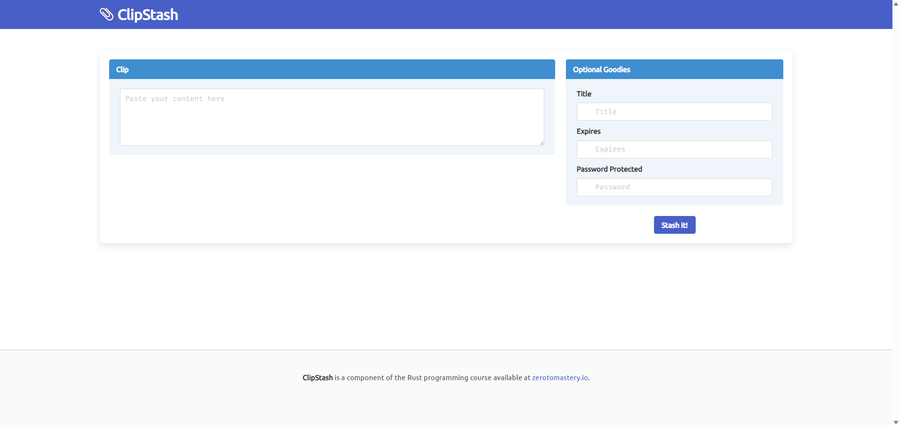
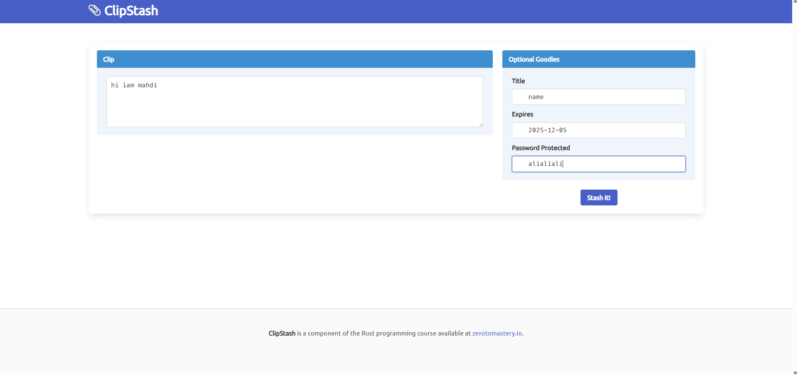
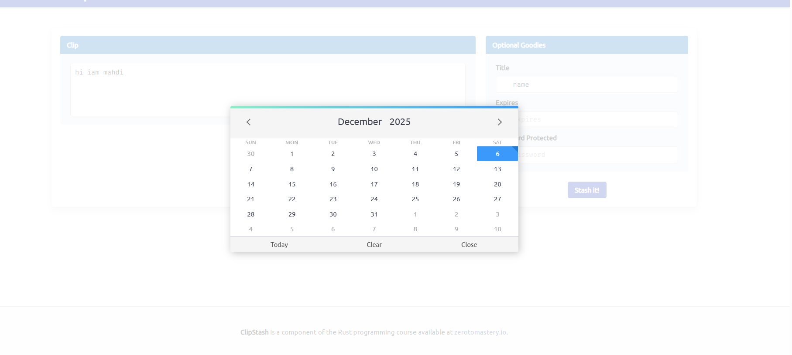
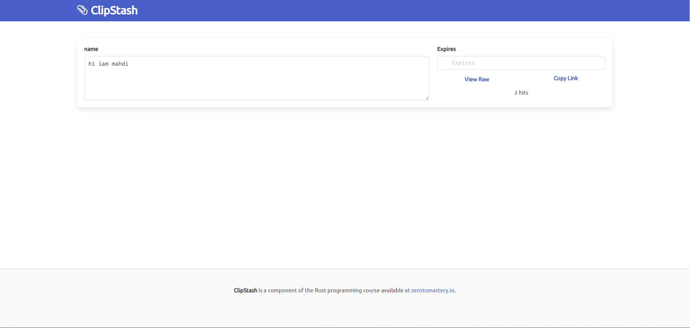
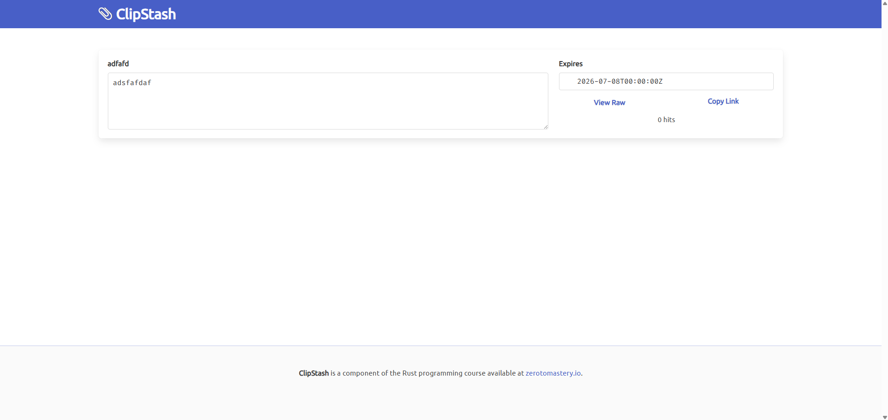
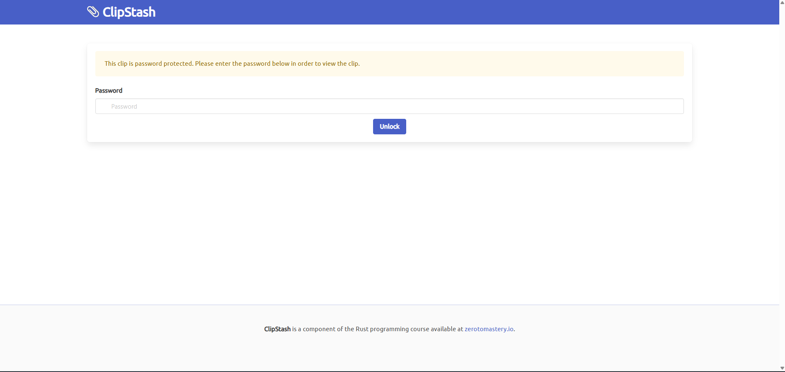

# 🗂️ ClipStash

<div align="center">

```
  ____ _ _       ____  _             _   
 / ___| (_)_ __ |  _ \| |_   _  __ _| |_ 
| |   | | | '_ \| |_) | | | | |/ _` | __|
| |___| | | |_) |  __/| | |_| | (_| | |_ 
 \____|_|_| .__/|_|   |_|\__,_|\__,_|\__|
          |_|                             
```

**A modern, secure pastebin service built with Rust and Rocket**

[](https://www.rust-lang.org/)
[](https://rocket.rs/)
[](https://www.sqlite.org/)
[](LICENSE)
[]()

[Features](#-features) • [Installation](#-installation) • [Usage](#-usage) • [API](#-api) • [Architecture](#-architecture)

</div>

---

## 📋 Table of Contents

- [Overview](#-overview)
- [Features](#-features)
- [Installation](#-installation)
- [Quick Start](#-quick-start)
- [Usage](#-usage)
- [API Documentation](#-api-documentation)
- [Architecture](#-architecture)
- [Testing](#-testing)
- [Project Structure](#-project-structure)
- [Contributing](#-contributing)

---

## 🎯 Overview

ClipStash is a high-performance pastebin service that allows users to store and share text snippets securely. Built with Rust's type safety and Rocket's web framework, it provides a robust foundation for handling text content with features like password protection, expiration dates, and hit tracking.

### Screenshots

#### Home Page - Create a New Clip

The main interface for creating a new clip with a clean, modern design.



*The home page features a two-column layout: a large text area for content on the left, and optional settings (title, expiration date, password) on the right.*

#### Creating a Clip with All Fields

Example of creating a clip with all optional fields filled in.



*This screenshot shows the form with content, title, expiration date, and password protection all configured.*

#### Date Picker for Expiration

Interactive calendar picker for selecting clip expiration dates.



*The date picker allows users to easily select when their clip should expire, with a clean calendar interface.*

#### Viewing a Clip

Display page showing a saved clip with its content and metadata.



*The clip view page displays the content, title, expiration date, hit count, and provides options to view raw content or copy the link.*

#### Another Clip View

Another example of a clip display page.



*This shows a different clip with its own content and metadata displayed in the same clean interface.*

#### Password Protection

Password prompt for accessing protected clips.



*When a clip is password-protected, users must enter the correct password to view the content. The interface provides a clear, user-friendly password entry form.*

### Key Highlights

- 🚀 **Fast & Efficient**: Built with Rust for maximum performance
- 🔒 **Secure**: Password protection and API key authentication
- 📊 **Analytics**: Hit counter for tracking clip views
- ⏰ **Auto-Expiry**: Automatic cleanup of expired clips
- 🎨 **Modern UI**: Clean, responsive web interface
- 🔌 **RESTful API**: Full API support for programmatic access

---

## ✨ Features

### Core Features

- ✅ **Text Storage**: Store and retrieve text content with unique shortcodes
- 🔐 **Password Protection**: Secure clips with optional passwords
- 📅 **Expiration Dates**: Set automatic expiration for clips
- 📈 **Hit Tracking**: Monitor how many times a clip has been viewed
- 🏷️ **Titles**: Add optional titles to organize your clips
- 🗑️ **Auto-Cleanup**: Background maintenance task removes expired clips

### Web Interface

- 📝 Simple form-based interface for creating clips
- 🔍 Easy-to-use shortcode-based retrieval
- 🎨 Modern, responsive design with Bulma CSS
- 📱 Mobile-friendly layout

### API Features

- 🔑 API key-based authentication
- 📡 RESTful endpoints for all operations
- 📦 JSON request/response format
- 🔧 Command-line client included

---

## 📦 Installation

### Prerequisites

- **Rust** (1.70 or later) - [Install Rust](https://www.rust-lang.org/tools/install)
- **SQLite** (for database)
- **Cargo** (comes with Rust)

### Step 1: Clone the Repository

```bash
git clone https://github.com/yourusername/clipstash.git
cd clipstash
```

### Step 2: Install SQLx CLI

```bash
cargo install sqlx-cli --no-default-features --features sqlite
```

### Step 3: Setup Database

```bash
# Create the database
sqlx database create --database-url sqlite:data.db

# Run migrations
sqlx migrate run --database-url sqlite:data.db
```

### Step 4: Build the Project

```bash
cargo build --release
```

---

## 🚀 Quick Start

### Running the Server

```bash
# Development mode
cargo run --bin httpd

# Production mode (with custom database)
cargo run --bin httpd -- sqlite:production.db

# With custom template directory
cargo run --bin httpd -- --template-directory ./custom-templates
```

The server will start on `http://127.0.0.1:8000` by default.

### Accessing the Web Interface

1. Open your browser and navigate to `http://127.0.0.1:8000`
2. Paste your content in the text area
3. Optionally set a title, expiration date, or password
4. Click "Stash it!" to create your clip
5. Share the generated shortcode URL with others

---

## 💻 Usage

### Web Interface

#### Creating a Clip

1. Visit the home page at `http://127.0.0.1:8000`
2. Enter your content in the text area
3. (Optional) Add a title, expiration date, or password
4. Click "Stash it!"
5. You'll be redirected to your clip's page with a unique shortcode

#### Viewing a Clip

- Navigate to `http://127.0.0.1:8000/clip/<shortcode>`
- If password-protected, enter the password when prompted
- View the raw content at `http://127.0.0.1:8000/clip/raw/<shortcode>`

### Command-Line Client

The project includes a CLI client for API interactions:

```bash
# Get an API key first
curl -X GET http://127.0.0.1:8000/api/clip/key

# Create a new clip
cargo run --bin clipclient -- \
  new "Your content here" \
  --api-key <your-api-key> \
  --title "My Clip" \
  --expires "2024-12-31"

# Retrieve a clip
cargo run --bin clipclient -- \
  get <shortcode> \
  --api-key <your-api-key> \
  --password <optional-password>

# Update a clip
cargo run --bin clipclient -- \
  update <shortcode> "Updated content" \
  --api-key <your-api-key>
```

---

## 📡 API Documentation

### Base URL

```
http://127.0.0.1:8000/api/clip
```

### Authentication

Most API endpoints require an API key in the request header. The exception is the `/key` endpoint which generates a new API key.

```
x-api-key: <your-base64-encoded-api-key>
```

**Note:** To get started, first call `/api/clip/key` to generate an API key. The key will be printed in the server console logs.

### Endpoints

#### Generate API Key

**Note:** This endpoint does NOT require an API key. Use this to get your first API key.

```http
GET /api/clip/key
```

**Response:**
```json
{
  "message": "Api key generated. See logs for details."
}
```

**Important:** The API key will be printed to the server console/terminal logs. 

When you call this endpoint, you'll see output like this in your server terminal:
```
Api Key: <base64-encoded-key-here>
```

Copy the base64-encoded key from the server console. You'll need this key for all other API requests by including it in the `x-api-key` header.

#### Create Clip

```http
POST /api/clip/
Content-Type: application/json
x-api-key: <your-api-key>

{
  "content": "Your content here",
  "title": "Optional Title",
  "expires": "2024-12-31",
  "password": "optional-password"
}
```

**Response:**
```json
{
  "clip_id": "...",
  "shortcode": "abc123def4",
  "content": "Your content here",
  "title": "Optional Title",
  "posted": "2024-01-01T00:00:00Z",
  "expires": "2024-12-31T00:00:00Z",
  "password": null,
  "hits": 0
}
```

#### Get Clip

```http
GET /api/clip/<shortcode>
x-api-key: <your-api-key>
```

**Response:**
```json
{
  "clip_id": "...",
  "shortcode": "abc123def4",
  "content": "Your content here",
  "title": "Optional Title",
  "posted": "2024-01-01T00:00:00Z",
  "expires": "2024-12-31T00:00:00Z",
  "password": null,
  "hits": 5
}
```

#### Update Clip

```http
PUT /api/clip/
Content-Type: application/json
x-api-key: <your-api-key>

{
  "shortcode": "abc123def4",
  "content": "Updated content",
  "title": "New Title",
  "expires": "2025-12-31",
  "password": "new-password"
}
```

**Response:**
```json
{
  "clip_id": "...",
  "shortcode": "abc123def4",
  "content": "Updated content",
  "title": "New Title",
  "posted": "2024-01-01T00:00:00Z",
  "expires": "2025-12-31T00:00:00Z",
  "password": null,
  "hits": 5
}
```

### Error Responses

All endpoints may return the following error codes:

- `400` - Bad Request (invalid API key format or missing API key)
- `401` - Unauthorized (invalid password or API key)
- `404` - Not Found (clip doesn't exist)
- `500` - Internal Server Error

### Example: Complete API Workflow

Here's a complete example of using the API:

```bash
# Step 1: Generate an API key (no authentication needed)
curl -X GET http://127.0.0.1:8000/api/clip/key
# Response: "Api key generated. See logs for details."

# IMPORTANT: Check your server console/terminal where you ran `cargo run --bin httpd`
# You'll see output like: "Api Key: <base64-encoded-key>"
# Copy that key - you'll need it for the next steps

# Step 2: Create a new clip (requires API key)
curl -X POST http://127.0.0.1:8000/api/clip/ \
  -H "Content-Type: application/json" \
  -H "x-api-key: <your-base64-api-key>" \
  -d '{
    "content": "Hello from API!",
    "title": "My First Clip",
    "expires": "2025-12-31"
  }'

# Step 3: Retrieve the clip (requires API key)
curl -X GET http://127.0.0.1:8000/api/clip/<shortcode> \
  -H "x-api-key: <your-base64-api-key>"
```

**Important Notes:**
- The `/api/clip/key` endpoint does NOT require an API key
- All other endpoints (`GET /api/clip/<shortcode>`, `POST /api/clip/`, `PUT /api/clip/`) require a valid API key
- The API key must be sent in the `x-api-key` header
- API keys are base64-encoded strings

---

## 🏗️ Architecture

ClipStash follows a **layered architecture** pattern with clear separation of concerns:

```
┌─────────────────────────────────────────┐
│           Web Layer (Rocket)            │
│  ┌──────────────┐  ┌─────────────────┐ │
│  │   HTTP UI    │  │   REST API       │ │
│  └──────────────┘  └─────────────────┘ │
└─────────────────────────────────────────┘
                  │
┌─────────────────────────────────────────┐
│         Service Layer (Business Logic)   │
│  ┌─────────────────────────────────────┐ │
│  │  Actions: new_clip, get_clip, etc.  │ │
│  └─────────────────────────────────────┘ │
└─────────────────────────────────────────┘
                  │
┌─────────────────────────────────────────┐
│        Domain Layer (Domain Models)      │
│  ┌─────────────────────────────────────┐ │
│  │  Clip, Title, Content, Password,   │ │
│  │  ShortCode, Expires, Hits, etc.   │ │
│  └─────────────────────────────────────┘ │
└─────────────────────────────────────────┘
                  │
┌─────────────────────────────────────────┐
│         Data Layer (Database)            │
│  ┌─────────────────────────────────────┐ │
│  │  SQLite + SQLx + Query Functions   │ │
│  └─────────────────────────────────────┘ │
└─────────────────────────────────────────┘
```

### Layer Responsibilities

#### Web Layer (`src/lib/web/`)
- HTTP routing and request handling
- Template rendering (Handlebars)
- API endpoint definitions
- Error handling and catchers

#### Service Layer (`src/lib/service/`)
- Business logic orchestration
- Transaction management
- Service-level error handling
- API key management

#### Domain Layer (`src/lib/domain/`)
- Domain models and entities
- Validation rules
- Business rules enforcement
- Type-safe field wrappers

#### Data Layer (`src/lib/data/`)
- Database connection management
- SQL queries and migrations
- Data model conversions
- Database error handling

### Key Design Patterns

- **Newtype Pattern**: Strong typing for domain fields (Title, Content, etc.)
- **Repository Pattern**: Data access abstraction
- **Service Layer Pattern**: Business logic separation
- **Dependency Injection**: Rocket's state management

---

## 🧪 Testing

### Running Tests

```bash
# Run all tests
cargo test

# Run with output
cargo test -- --nocapture

# Run specific test
cargo test test_name
```

### Test Coverage

The project includes comprehensive tests for:

- ✅ Domain field validation
- ✅ Database operations
- ✅ HTTP routes
- ✅ Password protection
- ✅ Error handling

**Current Test Results:**
```
running 10 tests
test domain::clip::field::content::test::disallow_empty_content ... ok
test domain::clip::field::password::test::default_is_none ... ok
test domain::clip::field::password::test::empty_password_is_none ... ok
test domain::clip::field::password::test::accepts_valid_password ... ok
test domain::clip::field::title::test::valid_title_allowed ... ok
test domain::clip::field::title::test::blank_title_converts_to_none ... ok
test data::query::test::clip_new_and_get ... ok
test web::http::test::gets_home ... ok
test web::http::test::error_on_missing_clip ... ok
test web::http::test::requires_password_when_applicable ... ok

test result: ok. 10 passed; 0 failed
```

---

## 📁 Project Structure

```
clipstash/
├── src/
│   ├── bin/
│   │   ├── httpd.rs          # HTTP server entry point
│   │   └── clipclient.rs     # CLI client for API
│   └── lib/
│       ├── mod.rs            # Library root
│       ├── data/             # Data layer
│       │   ├── mod.rs        # Database setup
│       │   ├── model.rs      # Database models
│       │   └── query.rs      # SQL queries
│       ├── domain/           # Domain layer
│       │   ├── clip/         # Clip domain
│       │   │   ├── field/    # Field types
│       │   │   │   ├── content.rs
│       │   │   │   ├── title.rs
│       │   │   │   ├── password.rs
│       │   │   │   ├── shortcode.rs
│       │   │   │   └── ...
│       │   │   └── mod.rs
│       │   ├── time.rs       # Time utilities
│       │   └── maintenance.rs
│       ├── service/          # Service layer
│       │   ├── action.rs     # Business actions
│       │   └── ask.rs        # Request types
│       └── web/              # Web layer
│           ├── api.rs         # REST API routes
│           ├── http.rs       # HTTP routes
│           ├── renderer.rs   # Template rendering
│           └── hitcounter.rs # Hit tracking
├── migrations/               # Database migrations
│   ├── 20210624130929_initial.sql
│   └── 20210716001908_api_key.sql
├── templates/               # Handlebars templates
│   ├── base.hbs
│   ├── home.hbs
│   ├── clip.hbs
│   └── ...
├── static/                  # Static assets
│   ├── clipstash.css
│   └── logo.svg
├── Cargo.toml
└── README.md
```

---

## 🔧 Configuration

### Environment Variables

Create a `.env` file (optional):

```env
DATABASE_URL=sqlite:data.db
ROCKET_PORT=8000
ROCKET_ADDRESS=127.0.0.1
```

### Command-Line Options

#### HTTP Server (`httpd`)

```bash
cargo run --bin httpd -- [OPTIONS]

Options:
  --connection-string <STRING>    Database connection string (default: sqlite:data.db)
  -t, --template-directory <DIR> Template directory (default: templates/)
```

#### CLI Client (`clipclient`)

```bash
cargo run --bin clipclient -- [COMMAND] [OPTIONS]

Commands:
  get <shortcode>              Get a clip
  new <content>               Create a new clip
  update <shortcode> <content> Update a clip

Options:
  --addr <URL>                Server address (default: http://127.0.0.1:8000)
  --api-key <KEY>             API key (required)
  --password <PASSWORD>        Password for protected clips
  --expires <DATE>            Expiration date (YYYY-MM-DD)
  --title <TITLE>             Clip title
```

---

## 🛠️ Development

### Setting Up Development Environment

1. **Install Rust toolchain:**
   ```bash
   curl --proto '=https' --tlsv1.2 -sSf https://sh.rustup.rs | sh
   ```

2. **Install development dependencies:**
   ```bash
   cargo install sqlx-cli --no-default-features --features sqlite
   ```

3. **Setup database:**
   ```bash
   sqlx database create --database-url sqlite:data.db
   sqlx migrate run --database-url sqlite:data.db
   ```

4. **Run in development mode:**
   ```bash
   cargo run --bin httpd
   ```

### Code Style

- Follow Rust standard formatting: `cargo fmt`
- Run clippy for linting: `cargo clippy`
- Ensure all tests pass: `cargo test`

---

## 🤝 Contributing

Contributions are welcome! Please follow these steps:

1. Fork the repository
2. Create a feature branch (`git checkout -b feature/amazing-feature`)
3. Commit your changes (`git commit -m 'Add amazing feature'`)
4. Push to the branch (`git push origin feature/amazing-feature`)
5. Open a Pull Request

### Contribution Guidelines

- Write clear commit messages
- Add tests for new features
- Update documentation as needed
- Ensure all tests pass
- Follow Rust best practices

---

## 📝 License

This project is licensed under the MIT License - see the [LICENSE](LICENSE) file for details.

---

## 🙏 Acknowledgments

- [Rocket](https://rocket.rs/) - Web framework
- [SQLx](https://github.com/launchbadge/sqlx) - Async SQL toolkit
- [Handlebars](https://handlebarsjs.com/) - Templating engine
- [Bulma](https://bulma.io/) - CSS framework

---

## 📞 Support

For issues, questions, or contributions:

- Open an issue on [GitHub](https://github.com/yourusername/clipstash/issues)
- Check the [documentation](https://github.com/yourusername/clipstash/wiki)

---

<div align="center">

**Made with ❤️ using Rust**

⭐ Star this repo if you find it useful!

</div>
